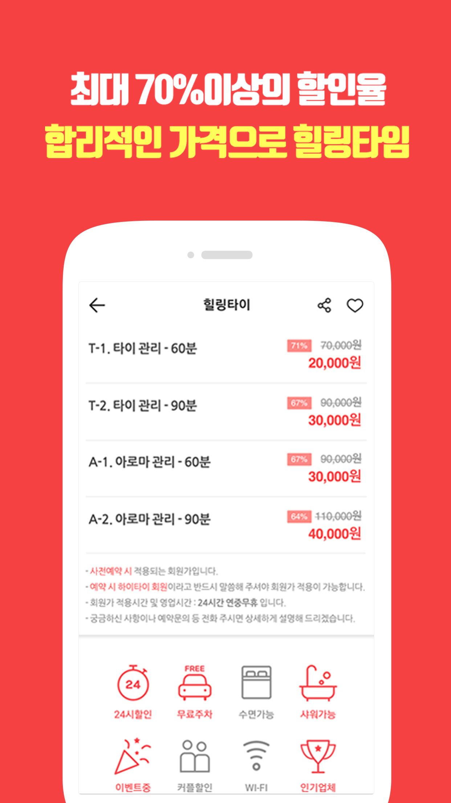
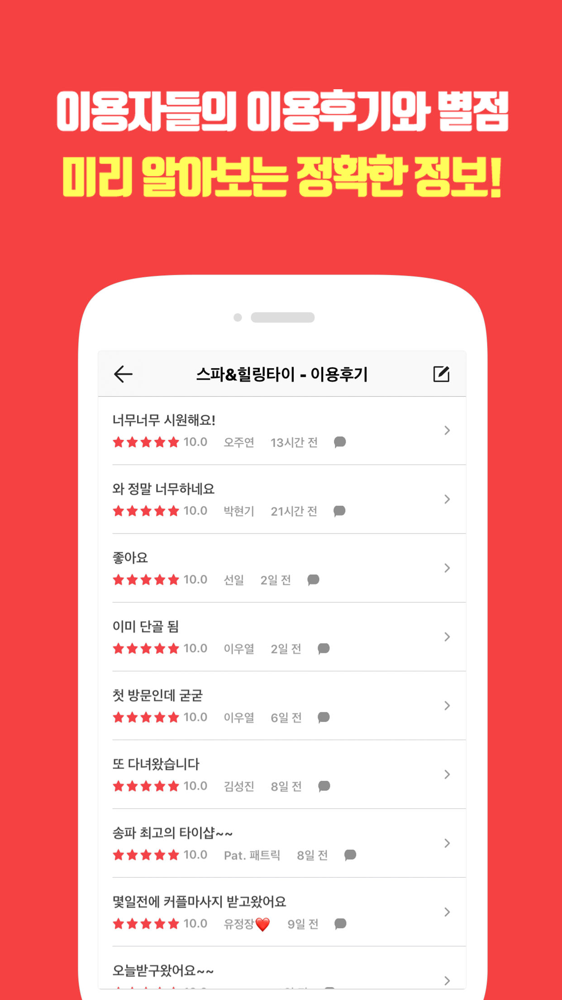
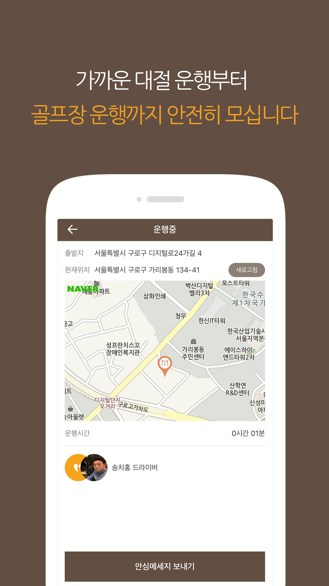
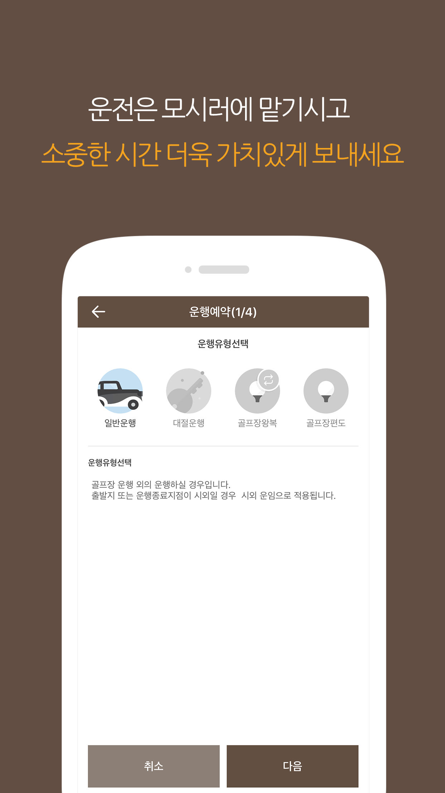
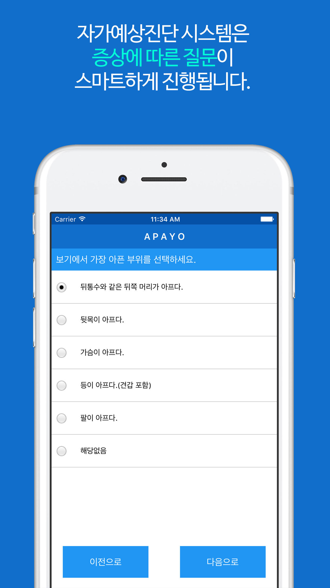
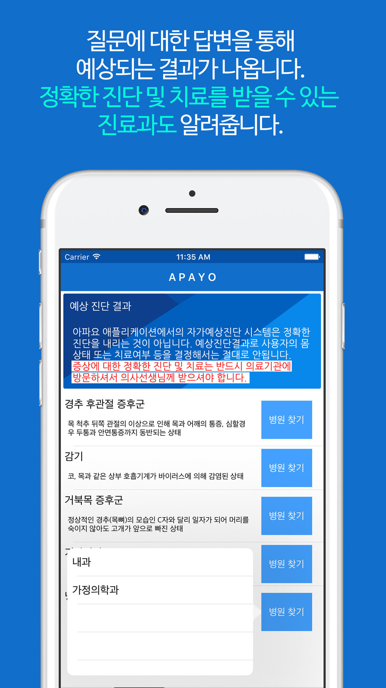
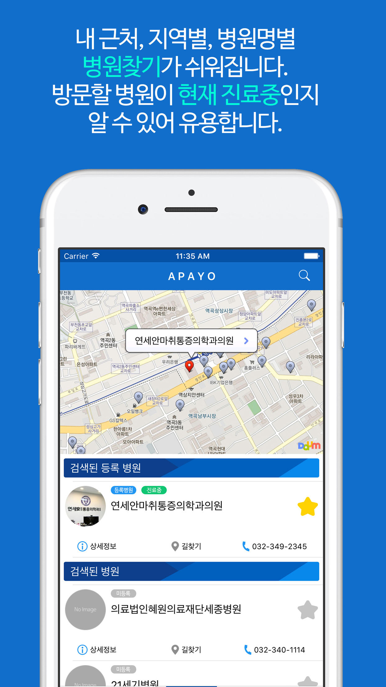
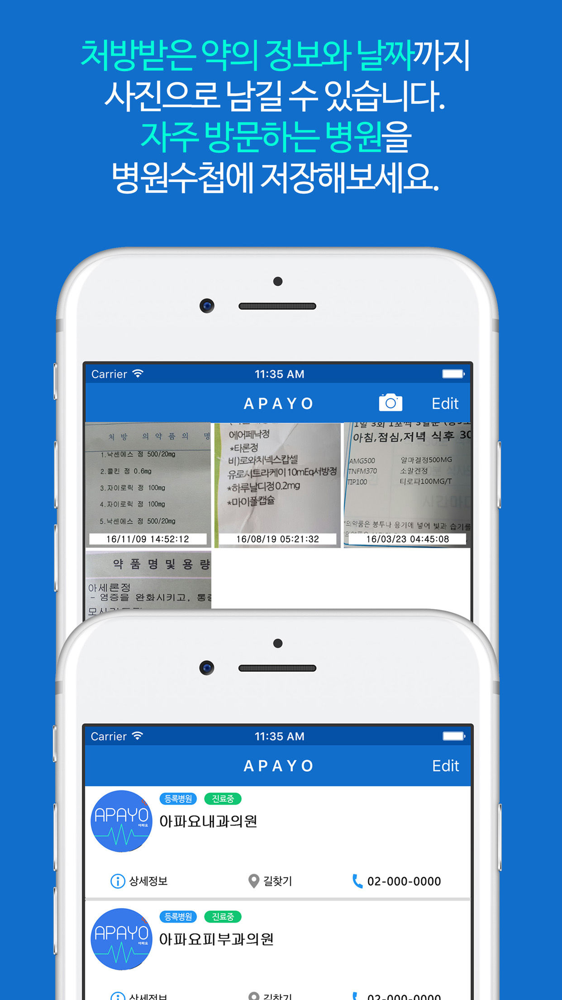

# 이력서

Blog : https://magi82.github.io

Facebook : https://www.facebook.com/bkhwang82

Github : https://github.com/magi82

 

# 경력사항

## 당근마켓
- 기간 : 2018.07 ~ 현재
- 직급 : iOS chapter lead
- 내용 : 당근마켓 iOS 개발 및 서비스
  - 중고거래, 동네생활, 채팅, 나의당근, 모바일 플랫폼

## 앱튜브
- 기간 : 2017.08 ~ 2018.07
- 직급 : 과장
- 내용 : iOS 개발 및 서비스

## 아파요 닥터
- 기간 : 2016.06 ~ 2017.07
- 직급 : 개발이사
- 내용 : iOS, Android 개발 및 서비스

## 그라비티
- 기간 : 2009.02 ~ 2016.07
- 직급 : 과장
- 내용 : 온라인게임 / 모바일게임 개발 및 서비스

## 이야소프트
- 기간 : 2006.11 ~ 2009.01
- 직급 : 주임
- 내용 : 온라인게임 개발 및 서비스

## 류엔소프트
- 기간 : 2005.05 ~ 2006.06
- 직급 : 사원
- 내용 : 온라인게임 개발 및 서비스

 

# 프로젝트

## 하이타이
- 소개 : 위치 기반의 태국 마사지샵 검색 서비스
- 소속 : 앱튜브
- 기간 : 2017.09 ~ 2018.07
- 내용 : iOS 개발 및 서비스
- 사용기술 : iOS, Swift, RxSwift, SnapKit, MGRelativeKit
- AppStore : https://itunes.apple.com/kr/app/id947725771

    

## 모시러
- 소개 : 위치 기반의 시간제 차량 수행 기사 서비스
- 소속 : 앱튜브
- 기간 : 2018.01 ~ 현재
- 내용 : iOS 개발 및 서비스
- 사용기술 : iOS, Swift, RxSwift, SnapKit
- AppStore : https://itunes.apple.com/kr/app/id1366011185

   

## 아파요
- 소개 : 자가 예상 진단을 토대로 해당 증상에 대한 병원을 찾아주는 어플리케이션
- 소속 : 아파요 닥터
- 기간 : 2016.06 ~ 2017.07
- 내용 : iOS, Android 앱 개발
- 사용기술 : iOS, Swift, AOS, Java, PHP
- AppStore : https://goo.gl/bSsWEc
- PlayStore : https://goo.gl/zuvfPm

    

## 라그나로크 : the war of emperium
- 소개 : 라그나로크 세계관을 배경으로한 핵앤슬래시 장르 모바일 게임
- 소속 : 그라비티
- 기간 : 2016.01 ~ 2016.07
- 내용 : 게임 컨텐츠 및 iOS 파트 개발
- 사용기술 : 언리얼3 엔진, C++, Objective-C
- https://www.youtube.com/watch?v=-ugNJIUxo7E

## 전투의 신
- 소개 : LOL 스타일의 MOBA 장르 모바일 게임
- 소속 : 그라비티
- 기간 : 2013.05 ~ 2015.12
- 내용 : 게임 컨텐츠 및 iOS 파트 개발
- 사용기술 : 언리얼3 엔진, C++, Objective-C
- https://www.youtube.com/watch?v=moQWkOwT9po

## 레퀴엠 온라인
- 소개 : 하드코어 장르의 온라인 MMORPG 게임
- 소속 : 그라비티
- 기간 : 2009.02 ~ 2013.05
- 내용 : 게임 컨텐츠 및 해외 로컬라이징 작업
- 사용기술 : 게임브리오 엔진, C++

## 묵향 온라인 (타이탄 온라인 시즌2)
- 소개 : 소설 묵향을 배경으로 제작된 무협 온라인 MMORPG 게임
- 소속 : 이야소프트
- 기간 : 2006.11 ~ 2009.01
- 내용 : 게임 컨텐츠 개발
- 사용기술 : DirectX, C++

## 원더킹 온라인
- 소개 : 횡스크롤 2D 온라인 MMORPG 게임
- 소속 : 류엔소프트
- 기간 : 2005.05 ~ 2006.06
- 내용 : 게임 컨텐츠 개발
- 사용기술 : DirectX, C++

 

# 오픈소스

## RxViewBinder
- RxSwift를 이용한 단방향 아키텍처 프레임워크 라이브러리
- https://github.com/magi82/RxViewBinder

## MGRelativeKit
- 퍼포먼스 향상을 위한 오토레이아웃이 아닌 프레임 기반의 관계형 레이아웃 킷 라이브러리
- https://github.com/magi82/MGRelativeKit

## MGStarRatingView
- 평점(별점)을 쉽고 간단하게 구현할수 있는 컨텍스트 기반 라이브러리
- https://github.com/magi82/MGStarRatingView

## MGGridView
- 2중 컬렉션뷰를 이용한 가로세로 확장형 그리드뷰 라이브러리
- https://github.com/magi82/MGGridView

 

# 보유기술

- Swift & Objective-C
- Clean Architecture(VIP, viper, RIBs)
- presentation pattern(MVP, MVVM, MVI, ReactorKit, RxViewBinder)
- TDD
- RxSwift
- Texture
- Autolayout(Storyboard & Code Base)
- WKWebView
- CoreData, Sqlite
- CoreML
- Firebase
- Crashlytics
- tuist
- CI/CD (github actions, bitrise)
